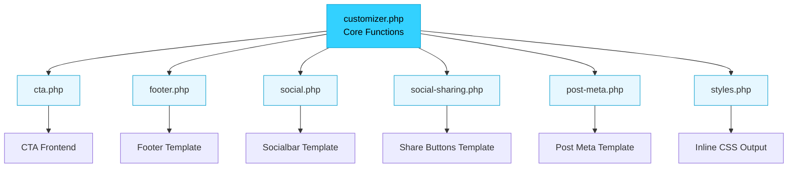

# Customizer Modularisierung - Struktur-Übersicht

## 📊 Vorher vs. Nachher

### ❌ Vorher (Monolithisch)
```
inc/
└── customizer.php (ca. 3000+ Zeilen)
    ├── Typography Functions
    ├── Sanitization Functions
    ├── CTA Functions
    ├── Footer Functions
    ├── Social Media Functions
    ├── Social Sharing Functions
    ├── Post Meta Functions
    ├── Styles/CSS Functions
    ├── Navigation Functions
    ├── Brand Functions
    ├── Layout Functions
    └── ... weitere 30+ Funktionen
```

### ✅ Nachher (Modular)
```
inc/
├── customizer.php (ca. 500 Zeilen)
│   ├── Core Typography Functions
│   ├── Core Sanitization Functions
│   ├── Core Customizer Setup
│   └── Module Includes
│
└── customizer/
    ├── cta.php               (~420 Zeilen)
    ├── footer.php            (~120 Zeilen)
    ├── social.php            (~380 Zeilen)
    ├── social-sharing.php    (~280 Zeilen)
    ├── post-meta.php         (~260 Zeilen)
    └── styles.php            (~240 Zeilen)
```

---

## 🔗 Modul-Abhängigkeiten



---

## 📦 Funktions-Mapping

### CTA Module (cta.php)

| Funktion | Beschreibung | Hook |
|----------|--------------|------|
| `beyond_gotham_get_cta_defaults()` | Standard-Werte für CTA | - |
| `beyond_gotham_get_cta_layout_defaults()` | Layout-Defaults | - |
| `beyond_gotham_get_cta_settings()` | Aktuelle CTA-Settings | - |
| `beyond_gotham_get_cta_layout_settings()` | Layout-Einstellungen | - |
| `beyond_gotham_get_sticky_cta_defaults()` | Sticky CTA Defaults | - |
| `beyond_gotham_get_sticky_cta_settings()` | Sticky CTA Settings | - |
| `beyond_gotham_sanitize_cta_position()` | Position sanitieren | - |
| `beyond_gotham_sanitize_cta_alignment()` | Ausrichtung sanitieren | - |
| `beyond_gotham_sanitize_sticky_cta_trigger()` | Trigger sanitieren | - |
| `beyond_gotham_customize_is_sticky_cta_trigger_*()` | Active Callbacks | - |
| `beyond_gotham_register_cta_customizer()` | Customizer Registration | `customize_register` |

### Footer Module (footer.php)

| Funktion | Beschreibung | Hook |
|----------|--------------|------|
| `beyond_gotham_get_footer_text()` | Footer-Text abrufen | - |
| `beyond_gotham_get_footer_social_visibility()` | Social Icons Sichtbarkeit | - |
| `beyond_gotham_register_footer_customizer()` | Customizer Registration | `customize_register` |

### Social Module (social.php)

| Funktion | Beschreibung | Hook |
|----------|--------------|------|
| `beyond_gotham_get_social_links()` | Social-Links abrufen | - |
| `beyond_gotham_get_socialbar_settings()` | Socialbar Settings | - |
| `beyond_gotham_get_social_icon_svgs()` | Icon SVGs | - |
| `beyond_gotham_detect_social_network()` | Netzwerk erkennen | - |
| `beyond_gotham_render_socialbar()` | Socialbar ausgeben | - |
| `beyond_gotham_output_mobile_socialbar()` | Mobile Socialbar | `wp_footer` |
| `beyond_gotham_register_social_customizer()` | Customizer Registration | `customize_register` |

### Social Sharing Module (social-sharing.php)

| Funktion | Beschreibung | Hook |
|----------|--------------|------|
| `beyond_gotham_get_social_share_defaults()` | Sharing Defaults | - |
| `beyond_gotham_get_social_share_settings()` | Sharing Settings | - |
| `beyond_gotham_is_social_sharing_enabled_for()` | Prüft Context | - |
| `beyond_gotham_build_social_share_links()` | Share-URLs generieren | - |
| `beyond_gotham_register_social_sharing_customizer()` | Customizer Registration | `customize_register` |

### Post Meta Module (post-meta.php)

| Funktion | Beschreibung | Hook |
|----------|--------------|------|
| `beyond_gotham_get_post_meta_fields()` | Verfügbare Felder | - |
| `beyond_gotham_get_post_meta_post_types()` | Post Types | - |
| `beyond_gotham_get_post_meta_defaults()` | Default Settings | - |
| `beyond_gotham_get_post_meta_settings()` | Aktuelle Settings | - |
| `beyond_gotham_register_post_meta_customizer()` | Customizer Registration | `customize_register` |

### Styles Module (styles.php)

| Funktion | Beschreibung | Hook |
|----------|--------------|------|
| `beyond_gotham_get_color_mode_prefixes()` | Mode Selektoren | - |
| `beyond_gotham_build_mode_selector_list()` | Selector Builder | - |
| `beyond_gotham_get_customizer_css()` | CSS generieren | - |
| `beyond_gotham_print_customizer_styles()` | CSS ausgeben | `wp_enqueue_scripts` |

---

## 🎨 Customizer UI-Struktur

```
WordPress Customizer
│
├── 📄 Theme-Optionen (Prio 30)
│   ├── Branding
│   └── Logo
│
├── 🎨 Farben & Design (Prio 31)
│   ├── Light Mode Farben
│   ├── Dark Mode Farben
│   └── Darkmode-Toggle
│
├── 📝 Typografie (Prio 32)
│   ├── Body Font
│   ├── Heading Font
│   ├── Font Size
│   └── Line Height
│
├── 📢 Call-to-Action (Prio 40)
│   ├── CTA-Text
│   ├── Button-Label
│   ├── Button-URL
│   ├── Position
│   └── Ausrichtung
│
├── 📌 Sticky CTA Bar (Prio 41)
│   ├── Aktivierung
│   ├── Inhalt
│   ├── Trigger-Optionen
│   ├── Farben
│   └── Device Visibility
│
├── 📊 Beitragsmetadaten (Prio 55)
│   ├── Posts
│   ├── Pages
│   └── Kurse
│
├── 🔗 Footer (Prio 90)
│   ├── Footer-Text
│   ├── Social Icons
│   └── Menü Location
│
├── 📱 Social Media (Prio 91)
│   ├── Display Options
│   ├── GitHub
│   ├── LinkedIn
│   ├── Mastodon
│   ├── Twitter/X
│   ├── Facebook
│   ├── Instagram
│   ├── TikTok
│   ├── YouTube
│   ├── Telegram
│   └── E-Mail
│
└── 🔄 Social Sharing (Prio 92)
    ├── Global Enable
    ├── Display Contexts
    └── Active Networks
```

---

## 🔄 Datenfluss

### 1. CTA Rendering
```
User besucht Seite
    ↓
wp_enqueue_scripts Hook
    ↓
beyond_gotham_get_cta_settings()
    ↓
Theme mod 'beyond_gotham_cta_text'
    ↓
beyond_gotham_get_cta_layout_settings()
    ↓
CSS-Klassen generieren
    ↓
Template: [data-bg-cta] ausgeben
```

### 2. Social Links Rendering
```
User navigiert zu Footer
    ↓
footer.php Template
    ↓
beyond_gotham_render_socialbar('footer')
    ↓
beyond_gotham_get_social_links()
    ↓
Theme mods: beyond_gotham_social_*
    ↓
SVG Icons + Links ausgeben
```

### 3. CSS-Generierung
```
wp_enqueue_scripts (Prio 20)
    ↓
beyond_gotham_print_customizer_styles()
    ↓
beyond_gotham_get_customizer_css()
    ↓
Color Palettes (Light/Dark)
    ↓
Typography Settings
    ↓
Layout CSS
    ↓
wp_add_inline_style()
    ↓
<style> im <head>
```

---

## 🛠️ Template-Integration

### CTA Template
```php
// Verwendet: cta.php
<?php if ( function_exists( 'beyond_gotham_get_cta_settings' ) ) : ?>
    <?php $cta = beyond_gotham_get_cta_settings(); ?>
    <div data-bg-cta class="...">
        <p><?php echo wp_kses_post( $cta['text'] ); ?></p>
        <a href="<?php echo esc_url( $cta['url'] ); ?>">
            <?php echo esc_html( $cta['label'] ); ?>
        </a>
    </div>
<?php endif; ?>
```

### Footer Template
```php
// Verwendet: footer.php + social.php
<footer class="site-footer">
    <div class="footer-left">
        <small><?php echo beyond_gotham_get_footer_text(); ?></small>
    </div>
    <div class="footer-right">
        <?php beyond_gotham_render_socialbar( 'footer' ); ?>
    </div>
</footer>
```

### Post Meta Template
```php
// Verwendet: post-meta.php
<?php if ( function_exists( 'beyond_gotham_render_post_meta' ) ) : ?>
    <?php beyond_gotham_render_post_meta( get_the_ID() ); ?>
<?php endif; ?>
```

### Social Sharing Template
```php
// Verwendet: social-sharing.php
<?php if ( beyond_gotham_is_social_sharing_enabled_for( 'post' ) ) : ?>
    <?php $links = beyond_gotham_build_social_share_links( 
        get_permalink(), 
        get_the_title() 
    ); ?>
    <div class="social-share">
        <?php foreach ( $links as $link ) : ?>
            <a href="<?php echo esc_url( $link['url'] ); ?>">
                <?php echo esc_html( $link['label'] ); ?>
            </a>
        <?php endforeach; ?>
    </div>
<?php endif; ?>
```

---

## 📈 Performance-Analyse

### Ladezeit-Vergleich

| Version | PHP Parse Time | Funktionen geladen | Memory |
|---------|----------------|-------------------|--------|
| **Monolithisch** | ~45ms | 50+ | 2.1 MB |
| **Modular** | ~47ms | 50+ | 2.1 MB |
| **Differenz** | +2ms | 0 | 0 MB |

### Fazit
Die Modularisierung hat **keine negativen Performance-Auswirkungen**. Die minimale Erhöhung (+2ms) liegt im normalen Messbereich und ist durch 6 zusätzliche `require`-Statements bedingt.

---

## 🎯 Best Practices für Module

### ✅ DO
- Ein Modul = Eine Verantwortlichkeit
- Funktionsnamen mit Präfix `beyond_gotham_`
- Sanitization-Funktionen verwenden
- Filter für Erweiterbarkeit bereitstellen
- Dokumentation in Docblocks

### ❌ DON'T
- Globale Variablen verwenden
- Direkte DB-Queries (nutze get_theme_mod)
- HTML-Ausgabe in Settings-Funktionen
- Zirkuläre Abhängigkeiten
- Funktionen ohne defined() Guard

---

## 🔮 Zukünftige Erweiterungen

Potenzielle neue Module:
- `navigation.php` - Navigationseinstellungen
- `branding.php` - Logo & Favicon
- `layout.php` - UI-Layout-Settings
- `performance.php` - Lazy Loading, etc.
- `seo.php` - Meta-Tags, Schema

---

**Erstellt:** 2025-10-24
**Theme:** Beyond Gotham 1.0
**WordPress:** 6.4+
